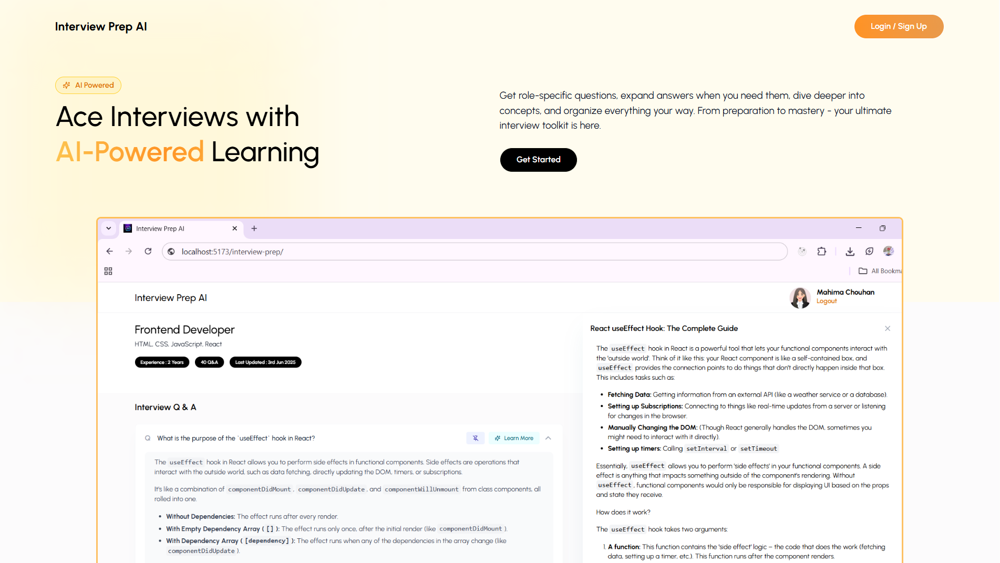
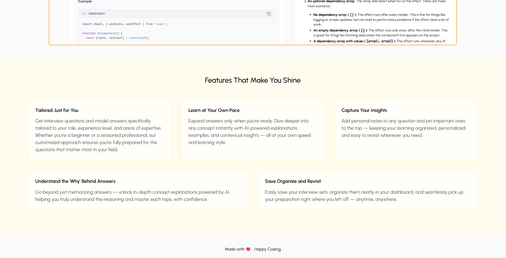
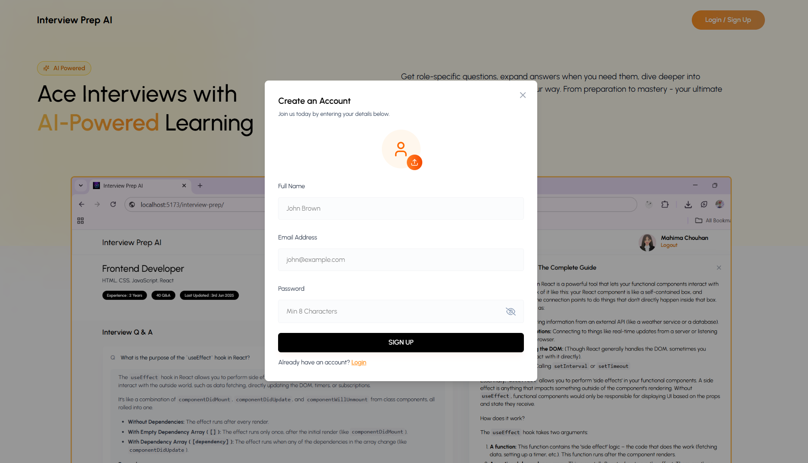
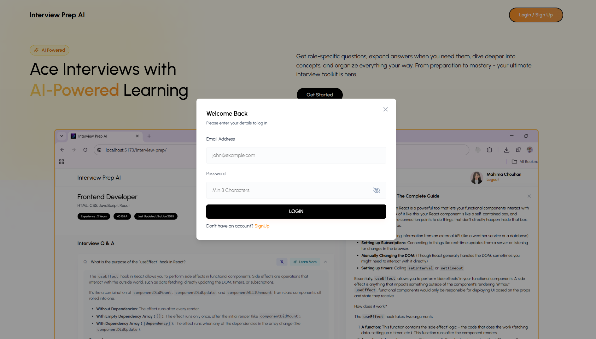
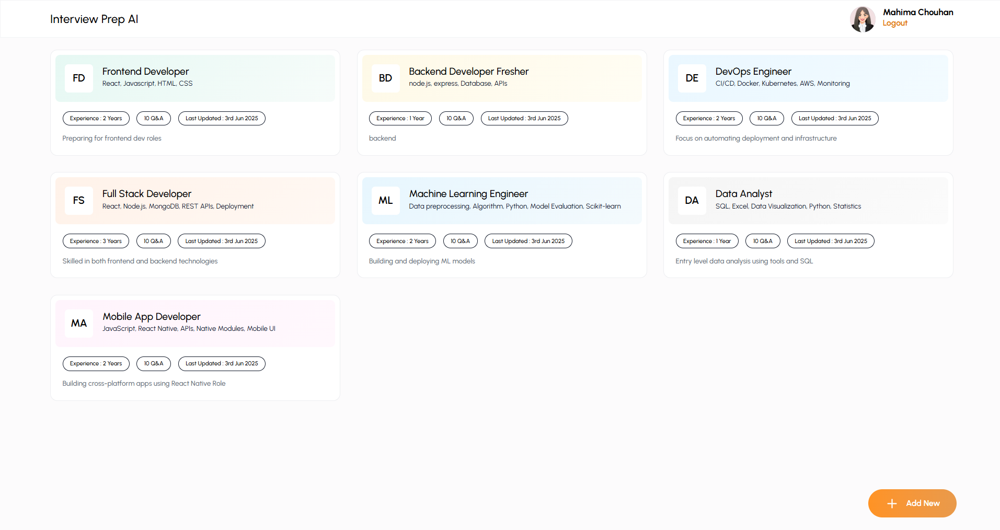
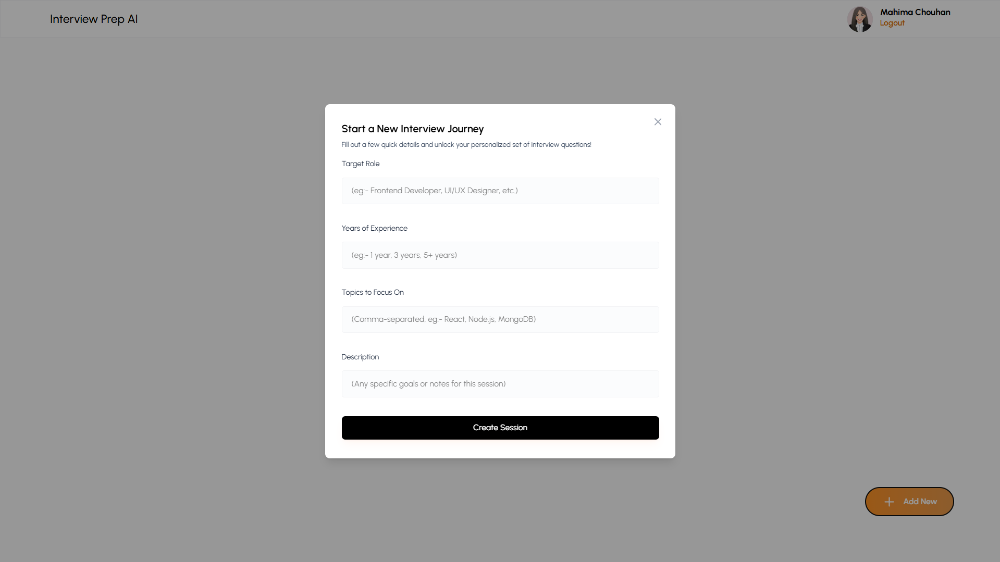
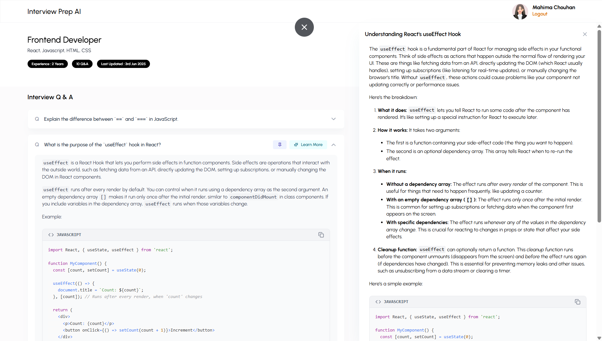

# 🧠 Interview Prep AI (MERN Stack)

**Interview Prep AI** is an intelligent interview preparation web application built using the **MERN stack** (MongoDB, Express, React, Node.js) with AI integration via the **Gemini API**. The app enables users to generate customized interview questions and answers based on job role and experience, review concepts through AI-generated explanations, and organize their prep journey with notes and pinned questions.

---

## 📌 Table of Contents

- [📷 Screenshots](#-screenshots)
- [✨ Features](#-features)
- [🧰 Tech Stack](#-tech-stack)
- [📁 Folder Structure](#-folder-structure)
- [⚙️ Setup Instructions](#️-setup-instructions)
- [🔐 Environment Variables](#-environment-variables)
- [🧠 AI Integration](#-ai-integration)
- [📄 License](#-license)

---

## 📷 Screenshots

#### Home Page



#### Sign Up


#### Login


#### Dashboard


#### Add New Search Interview Data


#### AI Generated Data


---

## ✨ Features

### 🔐 User Authentication
- Secure registration and login functionality.
- Token-based authentication using **JWT** for protected routes.

### 🧑‍💼 Role-Based Interview Sessions
- Generates relevant technical questions tailored to **specific job roles** and **experience levels**.
- Allows multiple session creation and management.

### 🤖 AI-Powered Q&A
- Uses **Gemini API** to generate:
  - Real-time technical questions.
  - High-quality, AI-generated answers.

### 📚 Accordion Learning UI
- Expandable and collapsible Q&A format for clean, focused reading.
- Easy navigation between questions.

### 💡 Dynamic AI Explanations
- On-demand topic explanations to deepen understanding.
- Great for self-paced learning and clarification of concepts.

### 📌 Pinning Important Questions
- Pin any important question for quick access later.
- Organize questions based on relevance and importance.

### 💾 Persistent Data with MongoDB
- All sessions, questions, and user data are stored in **MongoDB Atlas**.
- Ability to view, edit, or delete past sessions.

### 🎨 Responsive UI with Tailwind CSS
- Clean, modern design with mobile-friendly layout.
- Smooth UX transitions and accessibility features.

---

## 🧰 Tech Stack

| Tech              | Description                                  |
|-------------------|----------------------------------------------|
| **MongoDB**       | NoSQL database for session and user storage  |
| **Express.js**    | Backend server handling REST APIs            |
| **React.js**      | Frontend library for building UI             |
| **Node.js**       | Runtime environment for the backend          |
| **Tailwind CSS**  | Utility-first CSS framework for styling      |
| **JWT**           | JSON Web Tokens for secure authentication    |
| **Gemini API**    | AI service for generating questions/answers  |

---

## 📁 Folder Structure

```bash
interview-prep-ai/
├── frontend/ # React frontend
│ ├── src/
│ │ ├── components/ # Reusable components
│ │ ├── pages/ # Route-based pages
│ │ ├── services/ # API service logic
│ │ └── assets/ # Images, CSS
│ └── package.json
│
├── backend/ # Node + Express backend
│ ├── controllers/ # Business logic
│ ├── models/ # Mongoose schemas
│ ├── routes/ # API routes
│ ├── middleware/ # Auth middleware, error handling
│ └── config/ # DB and environment config
│ └── package.json
│
└── README.md
```


---

## ⚙️ Setup Instructions

#### 1. Clone the Repository

```bash
git clone https://github.com/chouhanmahima/Interview-Prep-AI
cd interview-prep-ai
```

#### 2. Add Environment Variables
```bash
PORT=3030
MONGO_URI=your_mongodb_connection_string
JWT_SECRET=your_secret_key
GEMINI_API_KEY=your_gemini_api_key
```

#### 3. Run the Application

- Start Backend:

```bash
cd server
npm run dev
```

- Start Frontend:
```bash
cd ../client
npm start
```
#### 4. live Link
```bash
    https://interview-prep-ai-frontend-86tn.onrender.com
```
---

## 🔐 Environment Variables

| Variable         | Description                       |
| ---------------- | --------------------------------- |
| `PORT`           | Server port (default: 3030)       |
| `MONGO_URI`      | MongoDB connection URI            |
| `JWT_SECRET`     | Secret key for signing JWTs       |
| `GEMINI_API_KEY` | API key for Gemini AI integration |

---

## 🧠 AI Integration

The app uses Gemini API to generate:

- Custom interview questions based on role & experience.

- Contextual AI-generated answers.

- Conceptual breakdowns for better understanding.

Replace GEMINI_API_KEY in your .env with a valid key to enable AI features.

---

## 📄 License

This project is licensed under the MIT License.